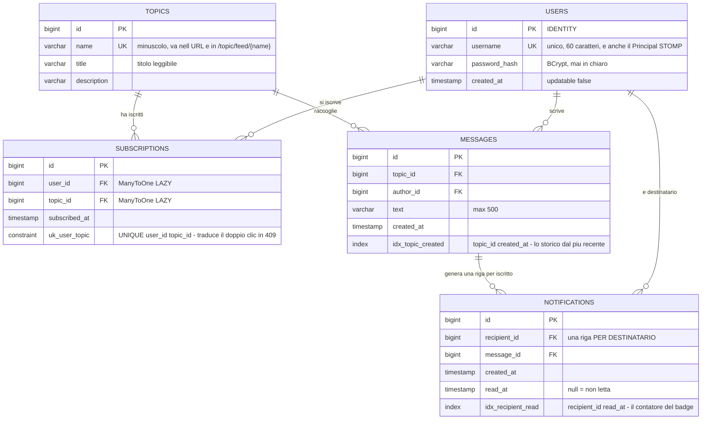
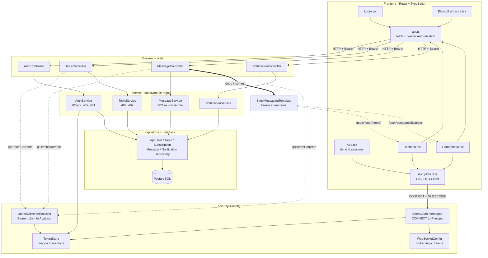
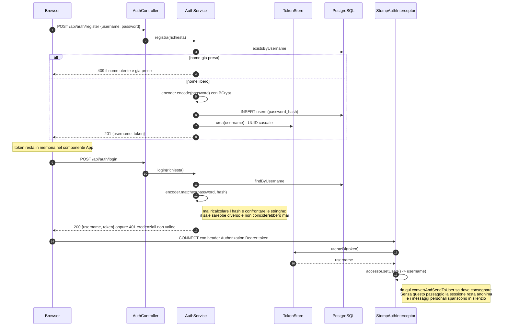
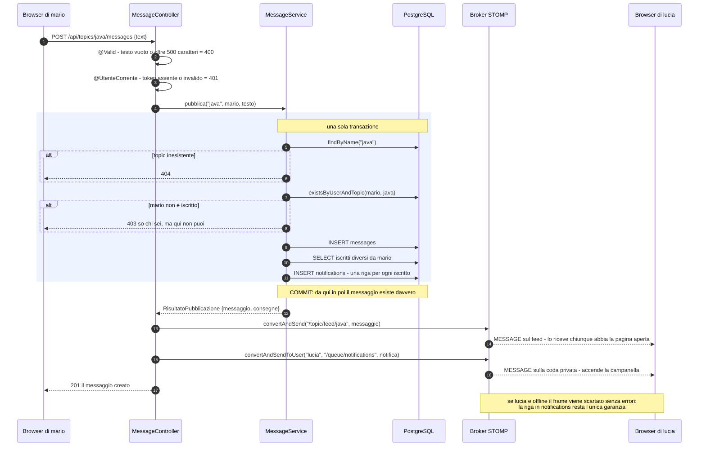
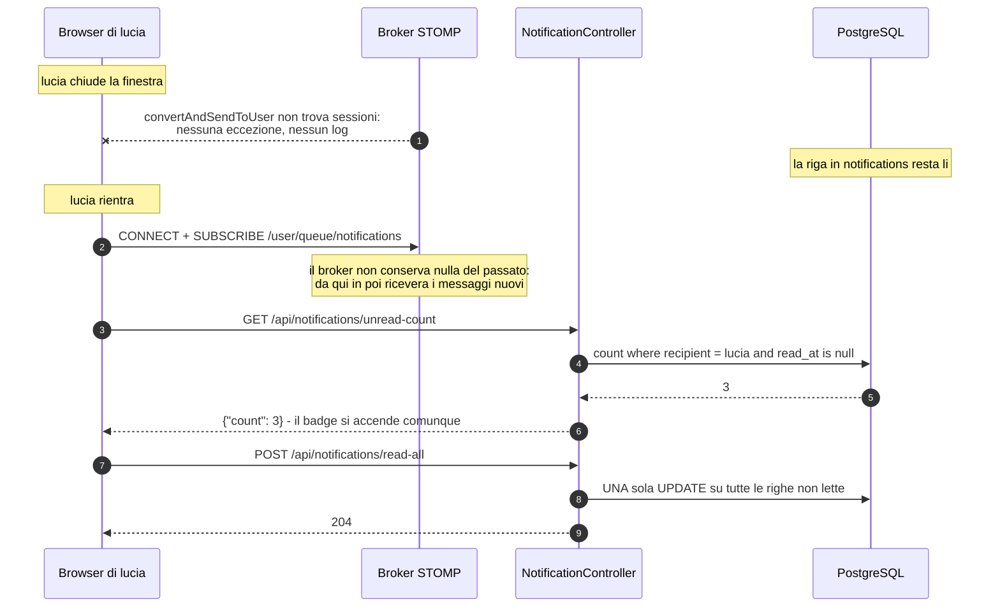
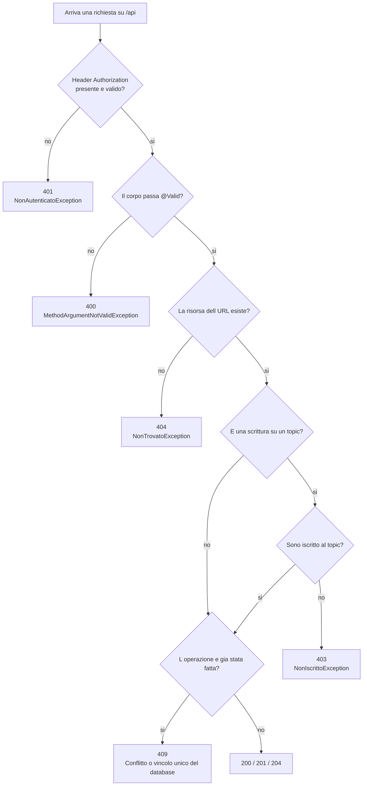

# Diagrammi del progetto

Tutti i collegamenti del progetto in sei diagrammi Mermaid.
GitHub li renderizza da solo; per modificarli si puo' incollare il singolo blocco
su <https://mermaid.live>.

---

## 1. Il modello dei dati (Passo 1)

Le cinque entita' e i vincoli. Le due che portano il peso del progetto sono
`subscriptions` (dice chi riceve e chi puo' scrivere) e `notifications`
(conserva quello che il canale ha gia' consegnato).

---

## 2. L'architettura: chi chiama chi

Le frecce continue sono chiamate diritte, quelle tratteggiate sono consegne
sul canale WebSocket. Da notare che il canale parte dal **controller**, non dal
service: cosi' i frame escono solo dopo il commit.

---

## 3. Registrazione, login e le due strade del token

Lo stesso token serve due volte: nell'header `Authorization` delle chiamate REST
e nell'header del frame `CONNECT`. E' il pezzo che rende possibile una notifica
indirizzata a una sola persona.

---

## 4. La pubblicazione di un messaggio (il cuore della consegna)

Una transazione che scrive due tabelle, e solo dopo il commit i due frame.

---

## 5. Chi era offline

Il caso che spiega perche' le notifiche si salvano su una tabella invece di
esistere solo come frame.

---

## 6. I codici di errore, in un colpo d'occhio

Confondere 401 e 403 e' l'errore piu' frequente della consegna:
**401 = non so chi sei**, **403 = so chi sei, ma qui non puoi**.

